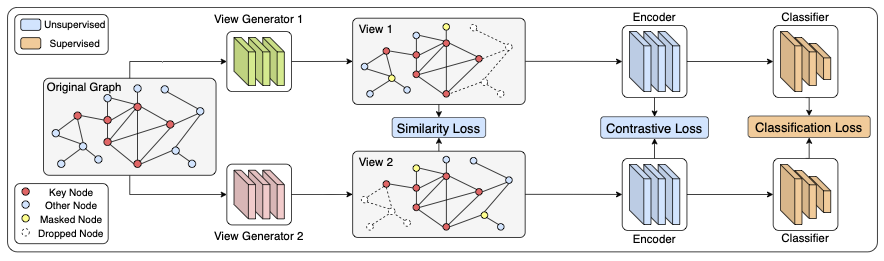

# AutoGCL: Automated Graph Contrastive Learning via Learnable View Generators (AAAI 2022)

Yin Yihang, Qingzhong Wang, Siyu Huang, Haoyi Xiong, Xiang Zhang

## Paper, Poster and Presentation



Please check our arXiv version [here](https://arxiv.org/abs/2109.10259) for the full paper with supplementary. We also provide our [poster](poster.pdf) in this repo. Our oral presentation video at AAAI-2022 can be found on YouTube, for both the [brief introduction](https://youtu.be/k5qiR8frfaM) and the [full presentation](https://youtu.be/37iavACXCIw).

## Requirement

```shell
rdkit
pytorch 1.10.0
pytorch_geometric 2.0.2
```

## Dataset Preparation

### TUDataset and MNISTSuperpixel

```shell
$ python download_dataset.py
```

## Semi-supervised Learning

There are many settings for semi-supervised learning, you can change to other experiments by changing the **--exp** flag. The node attribute augmentation is by default disabled, you can enable it by setting the **--add_mask** flag to True.  

```shell
$ python main.py --exp=joint_cl_exp --semi_split=10 --dataset=MUTAG --save=joint_cl_exp --epochs=30 --batch_size=128 --lr=0.01
```

You can use the give script to run multiple experiments, you may need to adjust the hyper-parameter like batch_size to make it runnable on your devices.

```shell
$ sh run.sh
```

## Unsupervised Learning

### Run

```shell
$ sh un_exp.sh
```

## Transfer `Learning`

### Prepare the Dataset

```shell
$ cd transfer
$ wget http://snap.stanford.edu/gnn-pretrain/data/chem_dataset.zip
$ unzip chem_dataset.zip
$ rm -rf dataset/*/processed
```

### Run the Fine-tuning Experiments

```shell
$ sh run_chem.sh
```

## Citation

If you find this work helpful, please kindly cite our [paper](https://arxiv.org/abs/2109.10259).

```latex
@article{yin2021autogcl,
  title={AutoGCL: Automated Graph Contrastive Learning via Learnable View Generators},
  author={Yin, Yihang and Wang, Qingzhong and Huang, Siyu and Xiong, Haoyi and Zhang, Xiang},
  journal={arXiv preprint arXiv:2109.10259},
  year={2021}
}
```
